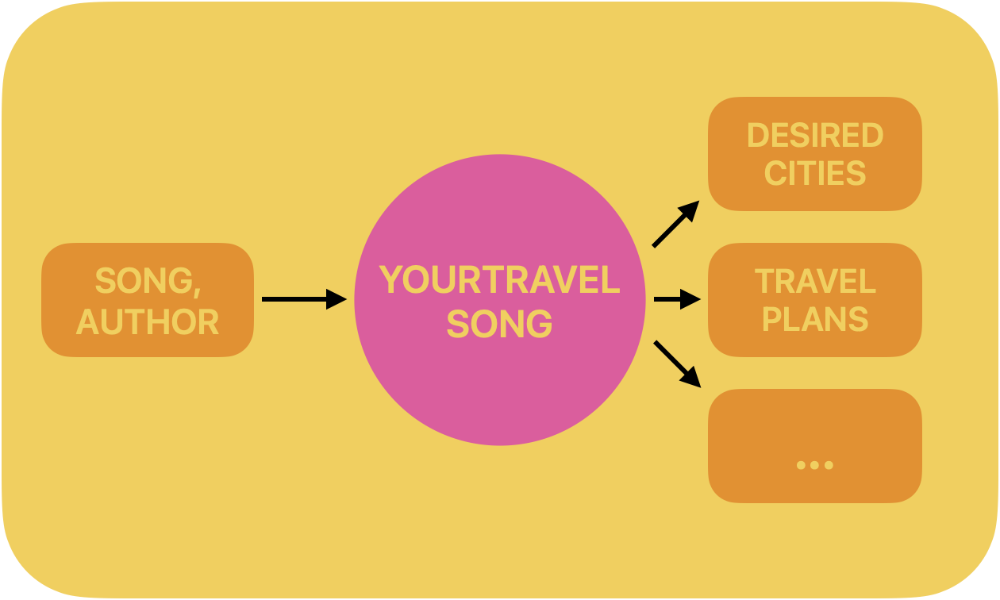

# Your Travel Song

## The goal of the project


Nowadays, LLM monetisation focuses mainly on charging for API use (e.g. OpenAI APIs), chatbots, and search (e.g) Perplexity.
On the other hand, most the personalized ads industry focuses on data such as search history and general preferences inputted by the user.
We think that LLMs have an amazing capability to make sense of text and understand the intent behind the text. We want to make use of that to exploit an untapped source of data, and use that for personalised ADs. This source of data are the songs we listen to every day on our streaming platforms. 
Music has the power to change our mental state, it can make us nostalgic, happy, sad, excited etc. And at the end of the day, this is exactly what brands try to do. They try to associate themselves with a certain sentiment. 
Now, what if when we listen to a song that awakes a certain feeling, we are presented with an AD from a brand that is trying to invoke that same sensation? This would take personalised ADs to a whole new level.
This is exactly what our project is about. We focused on travel industry to reduce the scope of the project to fit it in a Hackathon, but mainly, we try to make use of LLMs to align the lyrics of a given song to a brand, by matching them according to the sentiment they both aim to invoke in us.



## Architecture


## Technologies used

- Python
- LlamaIndex
- Flask
- MistralAI
- HuggingFace
- Ollama
- MongoDB
- Pinecone
- HookDeck (under working)


## Setup

To run the application, you need to install the required packages. You can do this by running the following command:

```
pip install -r requirements.txt```

```


## How to run

The backend is launched using the following command:

```
python EntryPoint
```
That will start the server on port 5000.
The API is composed by `getsuggestion` accessible via GET:

```
curl "http://127.0.0.1:5000/getsuggestion?artist=<Artist_Name>&title=<Song_title>" -H "Content-Type: application/json"
```

or via POST:

````commandline
curl -X post http://127.0.0.1:5000/getsuggestion -d '{"artist": "<Artist_Name>", "title":"<Song_title>"}' -H "Content-Type: application/json"
````


## To run the frontend


````
streamlit run Introduction.py
```
